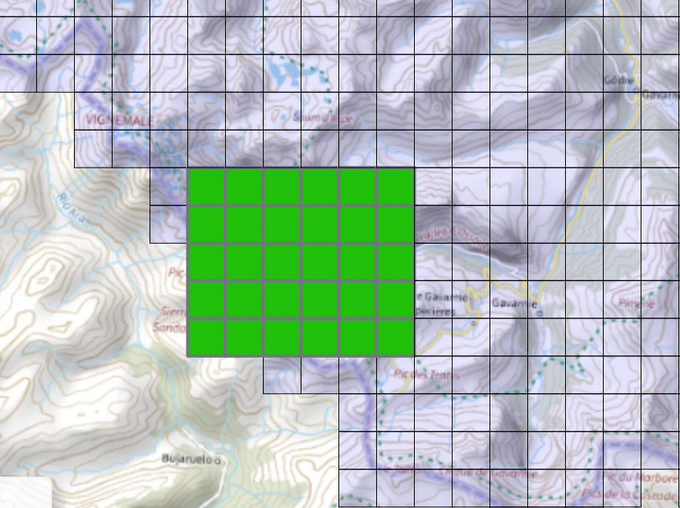

LIDAR Data from IGN of the zone near le Col de la Bernatoire, converted to STL with python and then processed in blender to have desired thickness/scale.

Thanks IGN for the LiDAR HD project !

https://diffusion-lidarhd.ign.fr/
